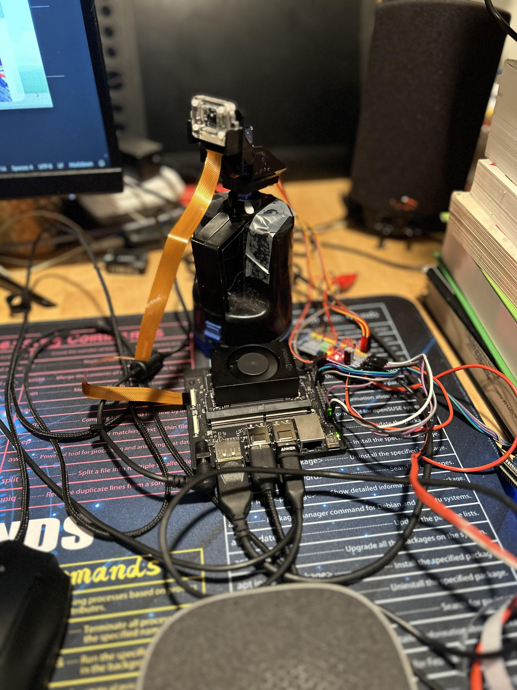

# jetson-ollava
This project aims to assess the feasibility of using generative AI, such as the large language model (LLM), on low-cost GPU-embedded devices to assist older people in living independently. 

## Idea:
By installing this device in elderly homes, the caretaker can remotely create a prompt to ask the AI model about situations in which they want to be alerted when they happen. The camera rotates on two axes and captures images regularly. The AI model interprets the image and sends the alert to caretakers when it detects a situation that matches the prompt.

Examples:
* When older people suddenly fall, the camera can capture the image and alert the caretaker. 
* When older people take the medicine, the camera can capture and send a message to the caretaker.
* When older people try to cook and cause a fire, the caretaker can be alerted immediately.

## Hardware Specifications :
 * Nvidia Jetson Orin Nano (https://files.seeedstudio.com/wiki/Jetson-Orin-Nano-DevKit/jetson-orin-nano-developer-kit-datasheet.pdf)
    * NVIDIA Ampere architecture with 1024 NVIDIA® CUDA® cores with 32 tensor cores
    * 6-core Arm® Cortex-A78AE v8.2 64-bit CPU
    * 8GB 128-bit LPDDR5 68 GB/s
 * CSI Camera (IMX 219) (https://docs.arducam.com/Nvidia-Jetson-Camera/Native-Camera/imx219/)

 * Anker USB Speaker and Microphone (PowerConfS330) (https://us.ankerwork.com/products/a3308)

 * Servo Connector (PCA8695) (https://www.adafruit.com/product/815)
 * Servo Motor (SG90) 2 axis (https://www.adafruit.com/product/1967)
 * 

## Software Specifications:
 * Nvidia Jetpack 6.0 (https://developer.nvidia.com/embedded/jetpack-sdk-60)
 * Ollama backend (https://github.com/ollama/ollama)
 * llava:7b (https://ollama.com/library/llava:7b)
 * Piper for text to speech (https://github.com/rhasspy/piper)
## Installations:
 * After the project is cloned 
    * `./build.sh` will build the docker image
    * `./run.sh` will run the docker container
## Usage:
* After the docker container is loaded
    * Run `python3 camera.py`